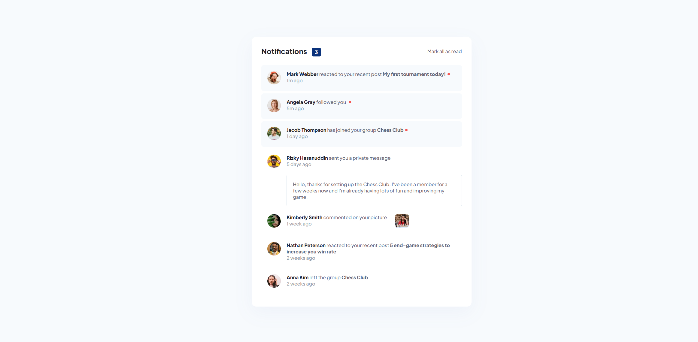

# Frontend Mentor - Notifications page solution

This is a solution to the [Notifications page challenge on Frontend Mentor](https://www.frontendmentor.io/challenges/notifications-page-DqK5QAmKbC). Frontend Mentor challenges help you improve your coding skills by building realistic projects. 

## Table of contents

- [Frontend Mentor - Notifications page solution](#frontend-mentor---notifications-page-solution)
  - [Table of contents](#table-of-contents)
  - [Overview](#overview)
    - [The challenge](#the-challenge)
    - [Screenshot](#screenshot)
    - [Links](#links)
    - [Built with](#built-with)
  - [Author](#author)

## Overview

### The challenge

Users should be able to:

- Distinguish between "unread" and "read" notifications
- Select "Mark all as read" to toggle the visual state of the unread notifications and set the number of unread messages to zero
- View the optimal layout for the interface depending on their device's screen size
- See hover and focus states for all interactive elements on the page

### Screenshot

### Links

- Solution URL: [Source Code](https://github.com/lucasdaher/notifications-page)
- Live Site URL: [Add live site URL here](https://your-live-site-url.com)

### Built with

- Semantic HTML5 markup
- CSS custom properties
- Flexbox
- React Hooks
- [React Router Dom](https://reactrouter.com/en/main)
- [React](https://reactjs.org/)
- [Vite](https://vitejs.dev/)
- [SASS](https://sass-lang.com/)

## Author

- GitHub - [Lucas Daher](https://github.com/lucasdaher)
- Frontend Mentor - [@lucasdaher](https://www.frontendmentor.io/profile/lucasdaher)
